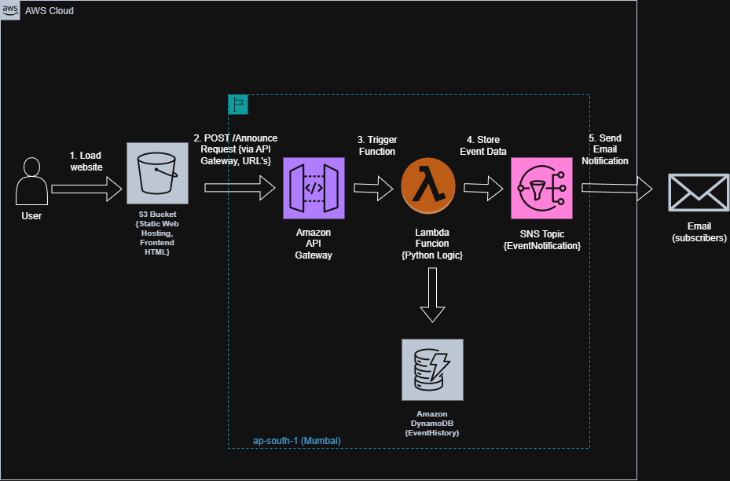

# aws-serverless-event-announcement-portal

This project is a full-stack cloud application that automates business notifications using a scalable, event-driven architecture on AWS.

## 🏗️ Architecture

1. **Frontend:** Hosted on **Amazon S3** for high availability.
2. **Entry Point:** **Amazon API Gateway** manages secure RESTful requests.
3. **Logic:** **AWS Lambda (Python)** processes data and handles service integration.
4. **Database:** **Amazon DynamoDB** logs every event for historical traceability.
5. **Messaging:** **Amazon SNS** handles multi-channel distribution to subscribers.

## 🛠️ Key Features
- **CORS Management:** Configured custom headers for secure browser-to-cloud communication.
- **Decoupled Messaging:** Used SNS Fan-out to allow for future SMS/Slack integrations.
- **Data Persistence:** NoSQL schema design in DynamoDB for fast event retrieval.

## 🚀 Impact
By utilizing a 100% serverless stack, this system eliminates server maintenance costs and scales automatically to handle sudden spikes in announcement volume.
